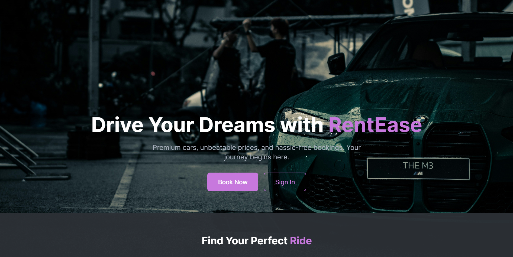
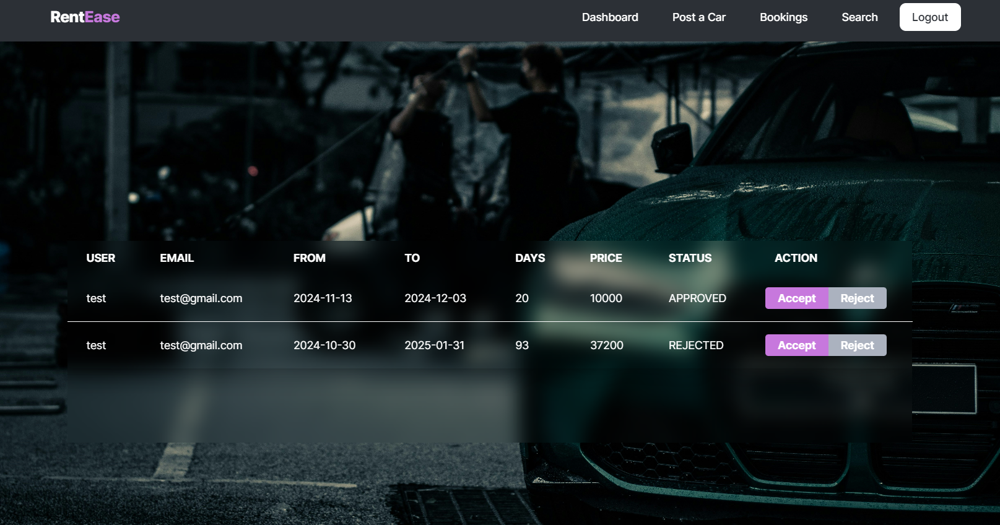

# Rent-A-Car Front End

This repository contains the front-end implementation of the Rent-A-Car project, developed using Angular and styled with Tailwind CSS.

## Features

- **Responsive UI**: Built with Tailwind CSS for a modern and responsive design.
- **Interactive User Experience**: Smooth navigation and user-friendly components for booking and browsing vehicles.
- **Integration**: Communicates seamlessly with the back-end API for data operations.

## Technologies Used

- **Angular**: Framework for building a dynamic and scalable single-page application.
- **Tailwind CSS**: Utility-first CSS framework for styling and responsive design.
- **SweetAlert2**: Used for stylish alerts and notifications.




## Getting Started

1. Clone the repository:
   ```bash
   git clone https://github.com/dulina2004/rent-a-car-frontend.git
   ```
